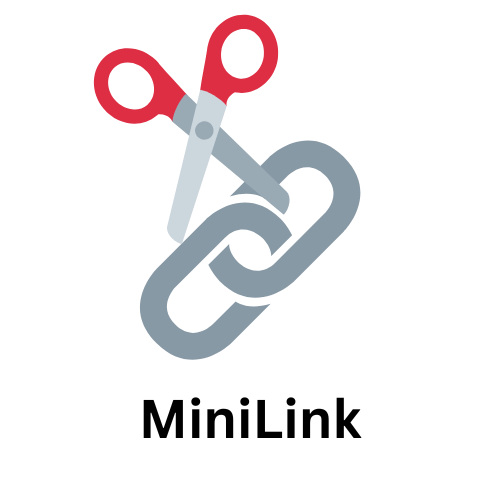

Minilink is a simple and fast URL shortener built with [Next.js](https://nextjs.org) and [Appwrite](https://appwrite.io). Easily create and share short links with a modern web interface.

## Features

- Shorten long URLs with a single click
- Built with Next.js for fast performance
- Uses Appwrite for  database
